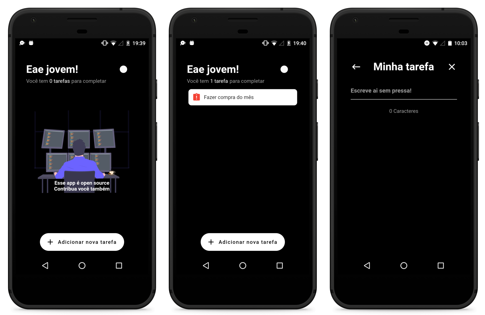

# ToDo App Open Source

> O aplicativo para que você possa organizar suas tarefas, com o código fonte aberto para qualquer desenvolvedor contribuir e aprender com o projeto!

## Screenshots

  

  

## Flutter

- [Flutter.dev](https://flutter.dev/)

## Plugins used

- [cupertino_icons](https://pub.dev/packages/cupertino_icons): ^0.1.2
- [splashscreen](https://pub.dev/packages/splashscreen): ^1.2.0
- [flutter_launcher_icons](https://pub.dev/packages/flutter_launcher_icons): ^0.7.4
- [auto_size_text](https://pub.dev/packages/auto_size_text): ^2.1.0
- [flare_flutter](https://pub.dev/packages/flare_flutter): ^1.8.3
- [mobx](https://pub.dev/packages/mobx): ^0.4.0+1
- [flutter_mobx](https://pub.dev/packages/flutter_mobx): ^0.3.6
- [get_it](https://pub.dev/packages/get_it): ^3.1.0
- [shared_preferences](https://pub.dev/packages/shared_preferences): ^0.5.6

## Additional

To contribute, consider these rules:

- https://semver.org/
- https://www.conventionalcommits.org/en/v1.0.0/

## Version

- 1.0.1: fix bug when task is empty
- 1.0.0: Release to PlayStore

## License

Released under the [MIT License](http://opensource.org/licenses/MIT).
